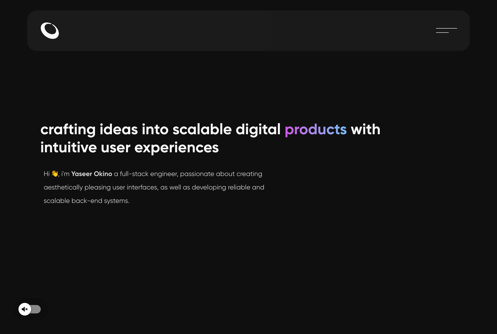

<a href="https://okino.dev/">
    
</a>

# Portfolio V1

Version one of my personal portfolio
<br/>
[Live Demo](https://okino.dev)



**Additional description about the project and its features.**

## Built With

- NextJs
- Chakra UI

## Tools

The following tools help make it easier to run this code.

- [Visual Studio Code](https://code.visualstudio.com/): A source code editor

- [Git](https://git-scm.com/downloads): A tool for managing source code

## Getting Started

### **Prerequisites**

To run this project you need [Node](https://nodejs.org/en/) and [PNPM](https://docs.npmjs.com/about-npm-versions) installed on your local machine

```bash
You can use any package manager of your choice, For this project PNPM was used
```

### **Setup**

If you have installed git you can clone the code to your machine, or download a ZIP of all the files directly.

[Download the ZIP from this location](https://github.com/yaseerokino/portfolio/archive/refs/heads/main.zip), or run the following [git](https://git-scm.com/downloads) command to clone the files to your machine:

```bash
git clone https://github.com/yaseerokino/portfolio.git
```

### **Install**

Once the files are downloaded or cloned on your machine, open your terminal and `cd to "portfolio" folder` and run the following commands:

**To install all dependencies**

```bash
pnpm install
```

**To build and configure webpack**

```bash
pnpm build
```

**To start development server**

```bash
pnpm dev
```

## Author

- GitHub: [@yaseerokino](https://github.com/yaseerokino)
- Twitter: [@yaseerokino](https://twitter.com/yaseerokino)
- LinkedIn: [Yaseer Okino](https://linkedin.com/in/yaseerokino)

## Show your support

Give a ⭐️ if you like this project!

## 📝 License

This project is [MIT](./LICENSE) licensed.
